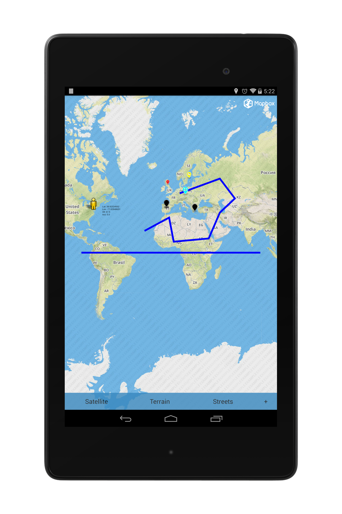

**This is pre-alpha software. It may be broken at any time in development,
and there is zero guarantee of API stability. Kick the tires at your own
risk, they may explode.**

[](https://travis-ci.org/mapbox/mapbox-android-sdk)

# Mapbox Android SDK

An open source alternative for native maps on Android.



## Including the library in your project

The development of the SDK is on its very earliest stage, so many of its elements
will be unstable and not fully tested. Otherwise you can build the library from
source, and experiment with the latest additions to the project.

### With Gradle

Add this to your `dependencies { }` statment of `build.gradle`:

```groovy
compile ('com.github.chrisbanes.bitmapcache:BitmapCache:2.4+@aar') {
    transitive = true
    exclude module: 'support-v4'
}
compile 'com.mapbox.mapboxsdk:library:0.2.2@aar'
compile 'com.nineoldandroids:library:2.4.0'
compile 'com.jakewharton:disklrucache:2.0.1'
compile 'com.google.guava:guava:16.0.1'
compile 'com.squareup.okhttp:okhttp:1.3.0'
```

### Building from source

**With Gradle** *(recommended)*

We use Gradle to generate a built version of our latest code in a matter of seconds.
To use it with your IDE, make sure that to import the project by selecting `build.gradle` (in the project root directory) as the project file.

Don't worry about installing Gradle on your system if you don't already have it (in fact it's easier if you don't).  The project makes use of Gradle Wrapper, which means that the correct / current project version of Gradle will automatically be installed and used to run the builds.  To use the Gradle wrapper just look for `gradlew` (UN*X) or `gradlew.bat` (Windows) in the project's main directory.  For example:

```
cd <PROJECT_ROOT>
 ./gradlew --version
```
which will produce something like:

```
------------------------------------------------------------
Gradle 1.10
------------------------------------------------------------

Build time:   2013-12-17 09:28:15 UTC
Build number: none
Revision:     36ced393628875ff15575fa03d16c1349ffe8bb6

Groovy:       1.8.6
Ant:          Apache Ant(TM) version 1.9.2 compiled on July 8 2013
Ivy:          2.2.0
JVM:          1.7.0_40 (Oracle Corporation 24.0-b56)
OS:           Mac OS X 10.9.2 x86_64
```

For more information:

http://www.gradle.org/docs/current/userguide/gradle_wrapper.html

**Manually**

Building from source means you get the very latest version of our code. The first step is to clone the repository to a directory in your system

```git clone https://github.com/mapbox/mapbox-android-sdk.git ```

#### Building in IntelliJ IDEA or Android Studio

* Created an Android project in IDEA
* Go to Import Module... and select the OSMDroid folder
* Repeat the step with the SDK
* Go to File-Project Structure-Modules, and add both projects as module dependencies of your app project.

## [Quick-start Guide](https://github.com/mapbox/mapbox-android-sdk/blob/master/QUICKSTART.md)
